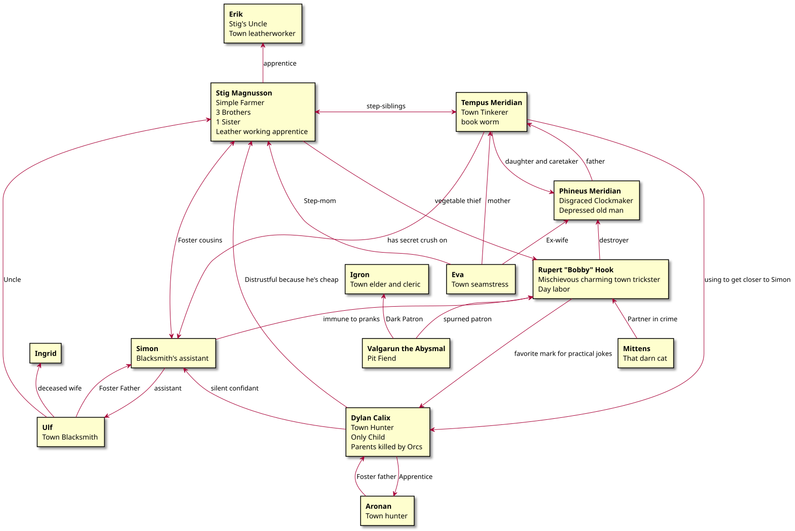
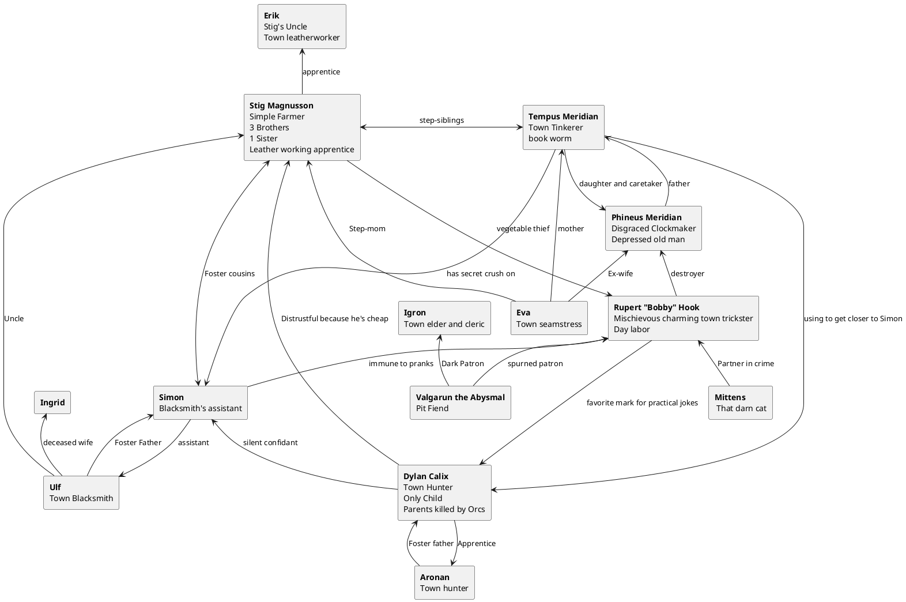

Campaign Notes
==============

Background
----------
A little backstory, your village of Vendido has about 1000 people. It is a small rural village on the edge of the great kingdom of Toran. The village is led by an village elder and cleric, Igron.

Butted against  the open spaces of the farm land is the dark forest surrounding the town. Full of gnolls, orcs, trolls and other savagery.

Alignment
---------

This campaign uses a numerical alignment system

#### Alignment Point Range
| Range  | Start |         |         |
|--------|-------|---------|---------|
|0-30    | 15    | Lawful  | Evil    |
|31-69   | 50    | Neutral | Neutral |
|70-100  | 85    | Chaotic | Good    |

#### Starting Alignment Compass
|  Starting   |         Lawful         |        Neutral          |        Chaotic          |
|-------------|------------------------|-------------------------|-------------------------|
| **Evil**    | Lawful(15) Evil(15)    | Neutral(50) Evil(15)    | Chaotic(85) Evil(15)    |
| **Neutral** | Lawful(15) Neutral(50) | Neutral(50) Neutral(50) | Chaotic(85) Neutral(50) |
| **Good**    | Lawful(15) Good(85)    | Neutral(50) Good(85)    | Chaotic(85) Good(85)    |

Characters
----------

<!--

```plantuml
@startuml dnd-thursday-2022

rectangle clem [
**Stig Magnusson**
Simple Farmer
3 Brothers
1 Sister
Leather working apprentice
]

rectangle erik [
**Erik**
Stig's Uncle
Town leatherworker
]

rectangle rob [
**Tempus Meridian**
Town Tinkerer
book worm
]

rectangle phineus [
**Phineus Meridian**
Disgraced Clockmaker
Depressed old man
]

rectangle eva [
**Eva**
Town seamstress
]

rectangle dave [
**Dylan Calix**
Town Hunter
Only Child
Parents killed by Orcs
]

rectangle aronan [
**Aronan**
Town hunter
]

rectangle martin [
**Simon**
Blacksmith's assistant
]

rectangle ulf [
**Ulf**
Town Blacksmith
]

rectangle james [
**Rupert "Bobby" Hook**
Mischievous charming town trickster
Day labor
]

rectangle mittens [
**Mittens**
 That darn cat
]

rectangle igron [
**Igron**
Town elder and cleric
]

rectangle ingrid [
**Ingrid**
]

rectangle valgarun [
**Valgarun the Abysmal**
Pit Fiend
]


james <-- valgarun : spurned patron
igron <-- valgarun : Dark Patron

ingrid <-- ulf : deceased wife

phineus <-- rob  : daughter and caretaker
phineus <-- eva : Ex-wife
clem <-- eva : Step-mom
rob <-- phineus : father
phineus <-- james : destroyer
clem <-> rob : step-siblings
martin <-- rob : has secret crush on
dave <-- rob : using to get closer to Simon

rob <-- eva : mother

dave <-- aronan : Foster father
aronan <-- dave : Apprentice
clem <-- dave : Distrustful because he's cheap

ulf <-- martin : assistant
martin <-- ulf : Foster Father

james <-- clem : vegetable thief
dave <-- james : favorite mark for practical jokes
erik <-- clem: apprentice
clem <-> martin : Foster cousins
clem <-- ulf  : Uncle
james <-- martin : immune to pranks
martin <-- dave : silent confidant

james <-- mittens  : Partner in crime

@enduml
```
-->

Places
------

Vendido
: The Party's Home village
: A village of about 1000 people. It is a small rural village on the edge of the great kingdom of Toran. The village is led by an village elder and cleric, Igron.

The Dark Forest
: Butted against  the open spaces of the farm land is the dark forest surrounding Vendido.
: Extending for many leagues in all directions few from the smaller villages ever bother to travel through it.
: Full of gnolls, orcs, trolls and other savagery.

Avernus
: The first level of hell. The main battleground of the Blood War.

Players
-------

- Clem
- Dave
- Jim
- Martin
- Rob

Story So Far
------------

#### 2021-09-23
At the fall harvest festival a rider from the king arrived with grave news. The forces of the Dark Forest are  rising against the kingdom of men. 100 young strong backs from Vendido, including the party, have been conscripted into the King's Army.

Each was equipped with a long spear and leather armor. Igron gave an ominous speech to the group on the importance of their sacrifice for the worlds of men and wished them luck.

The group is preparing to venture out of the town at first light.

#### 2021-09-30
Captain Wallington leads the group out to join the army. On the way the 100 encounter an army of Gnolls and Ogres.

They fought valiantly, but in the end everyone in the army fell. The last thing any of them remember is a great fire sweeping the battle field.

They awoke to find themselves shackled, their clothes and armor in tatters as if from ages past, and the rest of their equipment gone.

They could tell they were not longer alive, and worse they were in hell.

A bearded devil yelling at them "Get up you maggots, WELCOME to the Blood War"

having developed a set of outsider traits the group is being dragged toward who knows what fiendish fate.

#### 2021-10-07

The characters were processed through initial entry. Some signing on for the blood war, Dylan. Others using guile to get to the Glowing Coral, the best, only, vegan gluten-free all you can eat buffet in Avernus. The place is filthy, but probably would just pass health code (with a small bribe).

Valgarun, Igron's dark patron,  came to personally welcome Bobby Hook. He spurned his offer for power.

#### 2021-10-14

Dylan is searching for the Blasphemous Library. The party leaves the Glowing Coral thru the turnstiles, being told once outside "no reentry".

Dylan accepts a duel from a large noble fencer. The fencer makes short work of Dylan rapidly sending him back to the barracks.

Stig, Bobby and Tempus turn in a quest to get a shovel for the servant of The Strangler.

Simon convinces the dwarf running the forge where the shovel was stolen to let him forge a new hammer and a pair of tongs.

Dylan, Bobby and Tempus fetch a deck of cards so that the magician can show them a magic trick. He booby traps Dylans card and douses them in blood.

The party finally meets up outside the library, as they are about to enter portals from the abyss open letting in a sea of demons and Mittens.

#### 2021-10-21
During a short 10-day skirmish in the blood war most of the city of Kaern was destroyed. The party was split early in the fighting and were each forced
to go into hiding.

The party members in the library were unable to find the contract as the stacks were sorted alphabetically by author.

A huge Balor, Baeleretrix, convinced Stig to help him destroy the only library that Dylan knew had a copy of his contract.

Simon and Stig were killed by demons.

The battle caused a lot of soulidus to change hands, as demons and devils killed each other.

Bobby Hook made a new friend a Sheriff Katherine Johnson, who helped reunite the party and told them
about a breach she found through the city walls.

The party in the city left and after a couple days of searching found the rest of the party in the wasteland surrounding the city.

#### 2021-11-04
The party followed Dylan thru the wasteland toward the more rocky area they originally arrived, in order to find a shelter.

On the way, there was howling. They were chased up onto a rocky precipice by a small pack of hell hounds.

After finding they could not get up to the party and were going to be slowly picked off the hell hounds ran off.

As they were climbing down Dylan noticed that the top of this rock outcrop was an entrance to a pocket dimension home to
a gnome wizard named Paul. In experimenting with inter-dimensional travel he got stranded here. He set up this pocket dimension to keep
himself safe. He invited the party to stay a few days, and they agreed to deliver his notes to a library in a higher plane.

#### 2021-11-18
Stig and Simon decided they didn't like the idea of collecting soulidus.

Simon decided to start forging. He needs to go back to town to get advice from the dreugar.

Dylan made a short bow out of the remains of the hell hounds.

Bob read the Tome of understanding getting +2 Wis.

Stig touched the book of vile darkness.

Tempus has the book of vile darkness and a Chronicles of a trip to Mechanus.

The party wants to go back to town.

Paul wants the party to collect the remains or 5 lemures(or similar), summoned by a bearded devil.

#### 2021-12-09
On the way back to the city, the party came upon a gang of demons looking for trouble.

3 quasits and 4 dretchs. 2 quasits escaped.

The party continues on their way to town.

#### 2021-12-16
The party barely killed a Hellcat at the entrance to a cave into the city.
Remaining HP
- Stig: -4
- Simon: -12
- Bob: 2
- Tempus: 9
- Dylan: 19

#### 2022-01-13
The party hid and tried to rest just inside the entrance to the cave, Dylan keeping watch.

Travelling further into the cavern the party encountered a giant swarm of rats, defeating it they made their way into the city.

#### 2022-01-20
Party acquired quest from ice devil lord of city to eliminate a rogue bearded devil, Illanthal.

#### 2022-02-17
The Party has just thrown back the curtain in a transported monastery to reveal a group of devils supporting the bearded devil they are tracking down.

They just finished off the bearded devil, 5 imps and 6 Lemures.
 searching they found a robe of the stars with 2 stars and a giant snake embroidered on it.

#### 2022-03-10
In the back room they find 6 slaves
- female half-orc timid delinquent Dead
- female half-elf passive doctor Gwendolyn Paine w/party
- female elf annoying inn keeper Galanthoril
- female human delicate leather worker Sidney Kane w/ party
- male human helpful peasant
- male half-orc quiet tanner

After travelling 2 of the 3 days back to the gnomes hideout and crossing ravanger tracks the party was ambushed and surrounded by 2 Medium beholders.
Sidney failed her stun save.

#### 2022-03-31
After a harrowing battle the characters managed to defeat the 2 smaller gauth beholders. To do so, Tempus had to tap into the dark knowledge of the tome
of vile darkness.

Sidney sleep thru the battle, affected by the stun and sleep rays.

#### 2022-04-28
As the party made their final way back to the gnomes home, a hell storm started to roll in. The party quickly found a cave to hide in. built an entrance
and plan to rest out the 13 hour storm.

They found a ravanger symbol near the entrance, and built a door to barricade the entrance.

Tempus decided to try to destroy the book of vile darkness after critically succeeding a decipher script check.

After leaving the tome in the hell storm it remained unscathed.

As she turned back into the cave, a Bone devil burst in from the storm demanding "I know the book is here, give it to me"

#### 2022-06-02
After turning the tide against the bone devil he swore vengeance against Tempus and the party before teleporting away.

The Hell storm ended and the party returned to Paul the gnome's magical hideaway.

The party took some time to rest while Simen and Dylan took some time to craft there items.

Paul took the materials and crafted a ring gate that would allow the party to return to his pocket dimension.

#### 2022-06-16

The party traded Illanthal's head for access to the portal to Mechanus.

After passing thru the portal, Tempus was affected by Planar shock, -1 to all d20 rolls until given a full chance to recover.

The party found themselves deep inside a formian hive surrounded by a dozen formian warrior demanding they comply and join the hive as workers.

They didn't accept the offer and have decided to fight.

#### Interlude
The party brought back a bunch of formians, but the fight spilt over into paul's lab.

The destruction from the fight caused the loss of some needed spell components, particularly mandrake root.

The party returned to the city to acquire some.

The party again avoided a roving band of ravengers

Then entered into the city though the passage under Klar Kuthon's pottery shop.

There they were attacked by Klar's guardian scorpions after being alerted by shrieker mushrooms

The party was split when the half that was scrapping the scorpion corpses was shooed out of the basement while the other half rested in a rope trick.

#### 2022-07-14
The party found a source on mandrake root from a local bartender and brewer, Boran Theus.

He works a a bar called the Astral Star. The wall behind the bar at the Astral Star is a giant tear in reality to the swirling other worldly depths of the Astral plane.

Boran said that the mandrake root they need could be gotten for 10000sp. The party does not have that kind of money or barter.

There was a young planes walker, Klar Kuthon, who fell into Avernus while exploring the Astral Plane.
He was willing to give the partly 1200gp for a piece of jacinth.
He helped Bobby Hook learn locate object.

#### 2022-07-28
The party squeezes into a crag in the passage under the city to search for a piece of jacinth.

Coming down a craggy slick rock face the party was attacked by piercers.

After the fight they found 2 magic weapons.

#### 2022-08-??
Down to the pool at the bottom

#### 2022-09-01
After being sent to the fighting pits on level 2, Dylan died while fighting a
Rogue named Jacob. Was reincarnated even more like a bearded devil, and fought
for his first victory in the arena. Before being able to enjoy his spoils,
Tempus and rest of the party upon making it to the 2nd level of hell summoned
Dylan. The bracer on his armed pulled with him a Bone Devil claiming ownership
of the pit fighter.

#### 2022-09-08
They defeat the bone devil. He promised Tempus a boon and released Dylan from his control.

They jumped through the ring gate.

#### 2022-09-15
After jumping thru the gate the party found themselves in a pocket dimension run
by a pit fiend. As the guardian to prevent escapees from the lower levels of
hell into the first level he was not disposed to release the characters.

Thru so convincing and fast talking the Devil offered Simen an chance to impress
him by crafting him a sword, with his friends lives in the  balance.
Simen constructed a double sword with a twist of hell chain infused into
structure, one side masterwork, the other socketed.

To push the piece over the top, he affixed 2 normal gems and a purple iolite Frost gem to the blade.

The sword was rushed, but showed the skills of the craftsmen. So the Pit Fiend took the sword and offered Simen a deal.

Eventually they agreed to:
1) Simen could keep his soul coin
2) He would serve the Baatezu by working in the hell forges crafting weapons for the blood war
3) He would agree to wear a binding cuff to keep him bound in service
4) The rest of the party by name would be safetly sent to Avernus

After Signing Simen was bound with the cuff, sent to the forges, while the party was teleported to back outside the Glowing Coral.

#### 2022-10-06
The party met an elf begging to see solidus as he was looking for his lost soul coin. He said his name was Leuca, The party decided to help him.

On their way back to the astral star, The party was attacked by an Erinyes. They managed to drive her off and get to the Inn. They are now resting up.

#### 2022-10-20

With the Mandrake the party was able to get Paul what he needed to build a portal out of hell to the plane the temple cam from.

Getting their they found their necroplasm forms were stuck in the Ethereal while Paul moved by himself to the material plane.

The party followed Paul, as night fell and he set up camp. It seemed that the shadows were growing larger and more intimidating and then they attacked...

#### 2022-11-03
The party defeated 7 shadows, Dave sniping the last one as it tried to run away.

#### 2022-11-17
As Bobby tried to rest the rest on watch tried to leave a message for Paul.
In the process they offended a tree spirit that left them to fight 2 more animated trees.
After that they encountered a quasit who talked to them of abyssal nonsense.

They travelled toward a town to find it was destroyed by  a balor, Baeleretrix. He tried to press them into service, but was distracted by a bunch of modrons.

The party used the distraction to slip away. and find a new place the paul set up camp. the time on the material plane seems to be moving faster. as after only a few hours the day is already over.

#### 2022-12-15
Travelled to a new town with:

A secretive cult of Baeleretrix that snuck in from the destroyed town looking to increase the ranks of the blood war
A church to Helm : offer to go to Nirvana from some modrons
A church to Selune : given a hint about how delicious wild boar stew at the One-eyed cat Tavern is

The one eye cat tavern is not serving Wild Boar stew, today.

#### 2023-01-05
Found the mysterious ghost of a poor young stable boy

When the boar stew was served 5 ruffians came in to feast. They turned out to be the Cultists the party was tracking:
1. The Leader a blackguard
2. The cleric
3. A rogue
4. A fighter
5. Another Fighter

#### 2023-01-12

The Cult members know something is up after Bobby stole the dagger. They went back into their room.

Rob wrote down the plan.

#### 2023-01-19
The Party killed the 2 low level fighters and cleric.

1. The Leader - Escaped with ghost touch dagger
2. The cleric - Dead and sent to the abyss
3. A rogue - Horribly injured, turned coward and escaped
4. A fighter - Dead and sent to abyss
5. Another Fighter - Dead and captured by party

#### 2023-01-26

The Party got a boon from Selune
They used it to get themselves and Paul sent to Mechanus
The Party has found a couple soul coins
Leuca has manifested more ghostly powers

#### 2023-02-02
Kobold professor: Kiblick
Got room in mechanus
Went to a the "greatest" restaurant in Mechanus.

#### 2023-02-23
Most of party went to Great Interplanary Data Laborium
Bobby went to the Conservatorium Grand Mycoloseum
Kabidil gnomish mushroom soup maker.

#### 2023-03-17
The party went to go oversee one of Lueca's experiments with a modron

while out there they encountered a flock of 5 archerai.
they won, but tempus was driven insane.
All but killing Dylan before shackling herself giving lueca a chance to more fully restrain her.

#### 2023-03-XX
Leuca finds himself with Dylan's unconscious (-4 HP) body and Tempus bound and struggling

#### 2023-04-06
The party teleported to ysgard where they were brought before Lord Manderson who offered them weapons if the proved their metal:
1) They must agree to the quest to slay the fire giant Hidbrog and his advisor Sulan the efreeti
2) They may rest in the hall for the night,but must not drink the mead

#### 2023-05-04
The party went to a festival thrown by Hidbrog. They tricked a body gaurd to leave his post with a rock.

#### 2023-05-11
The party traded rumors at the party trying to poison the minds of Hidbrog, Frelga, Sulan and their men.

The gang stayed together.

The party is next going to sabotage HidBrog's secret exit.

#### 2023-08-24
White Dragon hoard items:
    Arcane Scroll (False Life (150 gp)) (total 150 gp)
    Arcane Scroll (Grease (25 gp), Daze Monster (150 gp)) (total 175 gp)
    Divine Scroll (Detect Undead (25 gp), Inflict Light Wounds (25 gp), Cure Moderate Wounds (150 gp)) (Opposite effect or target curse) (total 200 gp)
    Heavy Steel Shield (Medium) (+2 shield) (4170 gp)
    Potion of Cat's Grace (300 gp)
    Potion of Cure Light Wounds (50 gp)
    Potion of Levitate (300 gp)
    Potion of Mage Armor (50 gp)
    Potion of Shield of Faith (+2) (50 gp)

#### 2023-09-14
Escaping the dragon's lair after falling for a stone falling ward

#### Missing chunk
Apricora

#### 2024-03-21
After escaping a magical maze containing a giant basilisk. The party defeated Frelga and her servitors.

#### 2024-04-04
The party captured and cleared the house in the city of Brass. finding the only inhabitant to be a strange Half-elf squatter name Derol.

#### 2024-04-18
The party is met by Mof Brisbane a local Efreeti who encourages them to throw a welcome party, but nothing too loud.
Bobby manages to impress the local witch.

For the party they bought fancy outfits, hire staff, performers and served the famous mushroom soup.

The Witch, Arwa, is about to show up (Her plan is to try to siphon some soul/hell energy off the party).

Guest list
----------
120 Total
4 of you
Mof Brisabane
Arwa (Half-dragon, Half-Elf)
79 other Efreetis
10 Other Genies
20 Fire Creatures, Not True
5 Others (Derol, Leonal(Sarah), Aboleth(with 4 attendents), Pixie, Baeleretrix)

#### 2024-04-25
The Party went well Baeletrix caused lots of trouble

Tempus made a wish that caused everyone in the City of Brass to reject their cybernetics

and Arwa kidnapped Leuca

GIFTS

1. Gauntlets of Ogre Power
2. Ring of mind shielding
3. Goggles of Night
4. Gloves of Dex +4
5. Stone of good luck (Luckstone)
6. Bracer's of archery, greater
7. Manual, Clay golem
8. Belt of Giant Strength

#### 2024-05-02

The party just started a fight with Arwa in her house.
They are standing inside of here symbol of death radius

Leuca is in the basement. And has been hit by enervation for 3 negative levels.

Bobby is still just outside the door
Dylan in standing the middle of the front hall and has heard someone coming up the stairs
Tempus just knocked the door down and is in front of Dylan.

Roll Initiative.

Arwa is trying to gain nighthag like powers by extracting Hell energy she is already a very powerful spell caster. Maybe make her a lvl 15 SCaster and she should have a bunch of summoned beasts. her house is full of ward to activate.

#### 2024-05-30

Leuca needs to find a way to restore 3 negative levels
Restoration
Magical revitalization
An outsider quest
immersion in a raw source of outsider energy
Absorb the souls out of solidas
Absorb the intelligence out of the paladin sword.

some quest givers
 Mysterious assassin cultist
 Baeltrix
 Tooth Fairy - ancient fey
 Vampire Cleric
 Couatl
 Mind flayer?
 Archon, Hound

#### 2024-06-20

Sneezeweed has had her wand taken by the evil wizard Naxxremis the Hateful.
He has used to drain her of her power, take over her realm and corrupt the beings therein.

The party battled 7 corrupted tooth fairies

Sneezeweed gave them some potions, good berries, 10000 sp and a parchment with directions to the magic realm:

Beware the dark of the forest.
Start at the mightiest Oak tree.
Turn toward the moss
Travel until you find the faeries circle
Recite a limerick to attract attention
Present the potter's tooth
Hop into the magic circle.

The party plane shifted to Ysgard w/ a dwarven locksmith they encountered named Baileron Wayfinder.
Instead of the usual bright snow covered forests they found it dark night with a bright full moon.
They could hear a wolf howl in the distance.

#### 2024-08-22
While searching the forests of Ysgard, the party noticed they were being staked by a pack of winter wolves led by a werewolf lord.
During the battle martin found his shadow magic was letting tooth faeries sneak across dimensions
After the fight 3 faeries turned invisible and escaped into ysgard. one winter wolf was also able to escape.
The party and the dwarf are now recuperating in a rope trick.

#### 2024-09-19
After outwitting a dragon to its death, the party scavenged the dragon for components and crossed the branches of Yggdrassil to get to the largest Oak tree in Arborea.

#### 2024-10-03
- The party found the mighty Oak w/ golden acorns (Heal + poison(ingested DC: 22, 1 CON drain / 2d8 CON damage))
- Party headed mossward ran into a group of Eladrin
    - Alessar Ghale servant of **** protector of the Olympian Glades or Arborea
- Alessar tasked them with returning with a golden acorn
- Baileron Waifinder, the dwarf lock smith,+ left the party to travel back to ysgard which he felt was closer to his home.
- a satyr led them in a dance and told them to take lots of acorns
- Dylan "met a Nymph" who implored him to take no more acorns than they need
- Dylan and Leuca took 0
- Tempus took 6
- Bobby Hook took 3 (maybe let him have one more he asked for 4)
- As they walked back mossward, they were suddenly surprised by a giant dire squirrel w/ a crazed look in its eyes. It wants your nuts.
    - Dire Weasel, Dire Bear, Dire Dire Weasel?

#### 2024-11-xx
The party split in the fight with the dire-squirrel

#### 2024-12-05
After bringing the acorn to the Eladrin, the party was free to continue their quest.
The followed the directions and open a portal to the edge of Sneezeweed's lands in the Feywild
A beautifully vibrant forest surrounding a barren waste land containing a giant tooth castle.

#### 2025-01-23
The party approach the Furcation zone around the castle. on the way the encountered a group of
Fey giants irritable from being forced out of the Furcation Zone. The party hid, The giants
noticed a very poorly hidden Mittens in the form of a dire bear. With a little quick thinking
Booby Hook was able to suggest they just continue on their way with just a single rock toss.
Encountering an isolated tooth fairy, Tempus managed to catch it with a bola. Questioning and then
releasing it the party learned of the acid swamp with a dragon and the swarms of tooth fairies in
the area. The also learned of the tunnels beneath the walls made by the "Dark Elves".

They are now searching for an entrance to such a tunnel.

#### 2025-01-30
Skipping stones on stone is a lot easier than water.
   -- Bobby Hook

They found an entrance in a cliff face. the door and first room were full of traps.
The ceiling was full of holes in foyer
after figuring it to be mostly a distraction
the white stone door creaked open while the shifting floor locked level and solid.

#### 2025-02-20
The entry way was to a Fey Deep Dwarf stronghold
The dreugar agreed to let the party pass through as they are trying to remove Nexremmis
The party has chosen to spend the night in the dwarves stronghold.
Dylan has done some batering with locals.
Bobby hook is gathering ingredients for making mushroom soup with the hope of swaying the
locals to help the party find the best way to the Ivory Palace.

##### 2025-03-06
Gloin Giantslayer - dwarven scout
Fought 4 bugganes

##### 2025-03-27
Gloin told the party that they were passing an underground Slag Giant town.

They sneaked past the town on a high ledge and got caught on tar paper.

After getting some distance from the giants the party decided to make use of a rope trick, with only a couple more hours to their exit.

leuca has a nightmare visit...

##### 2025-04-10
After a threatening conversation with Naxx Leuca has decided to continue on his path of goodness and niceness

Coming up to the foundation,

##### 2025-05-15
The party walked around the outside of the betoothed palace. sneaking past the dieing kola garden
getting to the entryway a great causeway guarded by a huge enamel Golem.
The party was able to slip in amongst the draperies.
watched a couple of drow be eviscerated by a swarm of tooth faeries
then watched the court proceedings of the Voice of the Enamel Emperor Naxxremis the Hateful
Then then slipped through the kitchen/workshop to the stairway up the first tower

They can either go out onto the roof or continue to the top of the tower.

##### 2025-05-22
The Party snuck up to the top of the top of the tower. Disarming a poison dart trap on the way up.
There they killed a watchmen "manning" a ballista. While Bobby Hook ate his lunch they found in a
nearby chest, Tempus raised the interest of a spire drake from one of the other towers.

##### 2025-06-19
They slayed the Drakes shockingly without raising the alarm.
The next plan is to see if they can fly to the other towers.

##### 2025-06-26
The party went back down toward the kitchens.
Running into a kitchen servant taking food to the guards they "volunteered" to deliver to Tooth chowder to
the guards. after a couple mild disastrous taste tests Bobby Hook, Dylan and Tempus were able to mix the poison from
the poison dart trap into a truly delicious(critical success 30 by Bobby Hook) dish designed to maximize gastric distress. The party got the guards
to let them past the golem to deliver the chowder. The seductive scent attracted goblins and Tooth fairies from duty and the barracks to try the toxic
stew. The party used the distraction to get down through towers 2 and 3 before the ill effects started to kick in. There among rows of doors the party fought their first enamel Golem.

##### 2025-07-24
After talking to to a group of uncorrupted faeries that Naxremis
is keeping to extract magical resources. The party decided to steal
a manual on the enamel golems from the basement lair. Leuca and
Dylan sneaked down and grabbed the book from the lab. Dylan found an
interesting sealed iron flask and Leuca was intrigued by a beautiful
bejeweled ring.
They got away back up to the treasury on the 2nd floor.

###### 2025-08-21
After learning that acid weakens the golems DR the party has started a frontal assault on the throne room. 
The party sneaked right up to the rooms entrance.

##### 2025-09-19
They have defeated Naxremis, 3 enamel golems and 2 swarm sof tooth faries.
They let Naxremis escape with his life and his golems if he promised to leave the wand and never return.

##### 2025-10-02
Cleaned out the castle. Tempus did some "redecorating" to the land scape restoring some order to the 
fey wild perhaps too much order. Dylan, Bobby Hook and the old pastry chef made some pastries, Sneezeweed 
showed up put everything right and re-combobulated Leuca with some fey wild magic.

###### Furcation Zone
1. a pack of fey cloud giants
2. tooth fairy scouts
3. a bunch of swarms of tooth fairies
4. ghouls
Alternative
3-4. goblins to pass the the moat and gates

5. moat has an acid monster - Mature adult green dragon

###### Foramen gates and Extracoronal gardens
An Huge Enamel golem (greater stone golem)

###### inside castle
The enamel golem workshop

stone golems and tooth fairies

final fight
2 swarms of tooth faeries
3+ enamel golems
The dark wizard ( A lich ?) can cast 2 spells per turn while in the castle.

cariogenic moat
incisor (mountain range)

cavity
cementum yellow layer around enamel
enamel
crown
deciduous dentition
dentin
pericoronal
prophylaxis
ranula top (big hill)

##### 2025-10-30
After returning to the City of Brass. The group went shopping. Dylan bought Bane arrows, Bobby hook bought some spell foci, for contingency.
While working on building their new Clay golem to wield Ardnor, the intelligent holy avenger. The party had faerie dreams waking to 
find 20000 GP under each of their pillows.

#### Ardnor, Clay Golem
Size/Type:	Large Construct
Hit Dice:	11d10+30 (90 hp)
Initiative:	-1
Speed:	20 ft. (4 squares)
Armor Class:	22 (-1 size, -1 Dex, +14 natural), touch 8, flat-footed 22
Base Attack/Grapple:	+8/+19
Attack:	 "+5 holy cold iron longsword" +20 melee (1d8+5+7 {+2d6 vs evil} )
Full Attack:	"+5 holy cold iron longsword" +20 melee (1d8+5+7 {+2d6 vs evil} ) and 1 slam +14 melee (2d10+7)
Space/Reach:	10 ft./10 ft.
Special Attacks:	Berserk(1% cumulative per round of combat), +5 holy cold iron longsword, 
Special Qualities:	Construct traits, damage reduction 10/adamantine and bludgeoning, darkvision 60 ft., immunity to magic, low-light vision 120ft
Special Abilities: haste (3 rounds) 1/day , Greater Dispel Magic (lvl 11) 3/day, Bless 3/day, 
Saves:	Fort +3, Ref +2, Will +3
Abilities:	Str 25, Dex 9, Con Ø, Int 10, Wis 14, Cha 14
Skills:	Intimidation 10 ranks (+17)
Languages: Common, Celestial
Feats:	—
Environment:	Any
Organization:	Solitary or gang (2-4)
Challenge Rating:	10
Treasure:	None
Alignment:	Lawful Good (Overzealous) (Special Purpose: slay evil outsiders)

##### 2026-01-15
Dave made some stone to flesh potions. 
Going back thru the entrance beneath Klar's shop the party was able to dicscern some nnon-linearities in time.
Their aid to young Klar changed old Klar's future.
Bobby Hook used is connection to mittens to track him down a a local "Infirmary and Enlightenment" center.
ON level 2 they found Mittens trapped in a bottle being prodded by 3 ice devils.
Battle Begins...

##### 2026-01-29
First level Find and save Mittens.
Locate object/find familiar will take the party to a demon keeping Mittens in a bottle.
The intent is to use Mittens in an experiment.
The blinded devils teleport out of the fight.

##### 2026-03-05
Second level
An elaborate illusion of Vendido. 
Everything is as they remember, but the people are all spread too thin.
Igron is there, but visibly nervous around the players.
Valagrun the abyssal is disguised as a person in the mayor's house.
When the party figures out what is happening the devil will offer to let them keep the domain in exchange for production.
He will let them change anything about the place they want, they can even move into the mayor's house.

##### The Final Battle
1 Pit Fiend
1 Horned Devil
2 Barbed Devils
