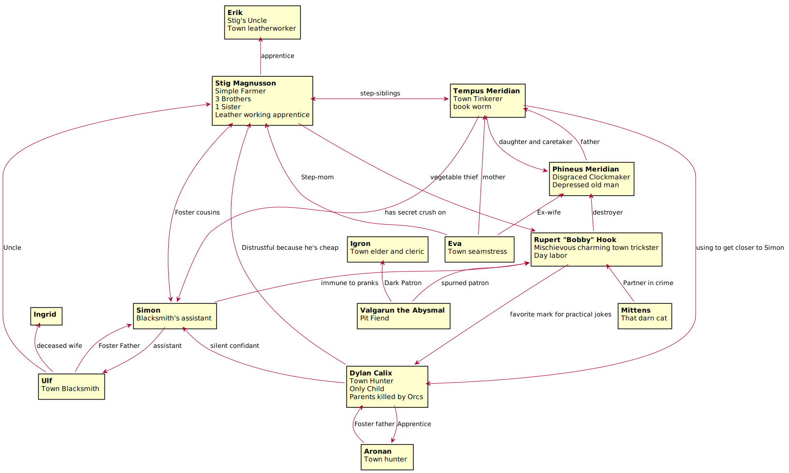
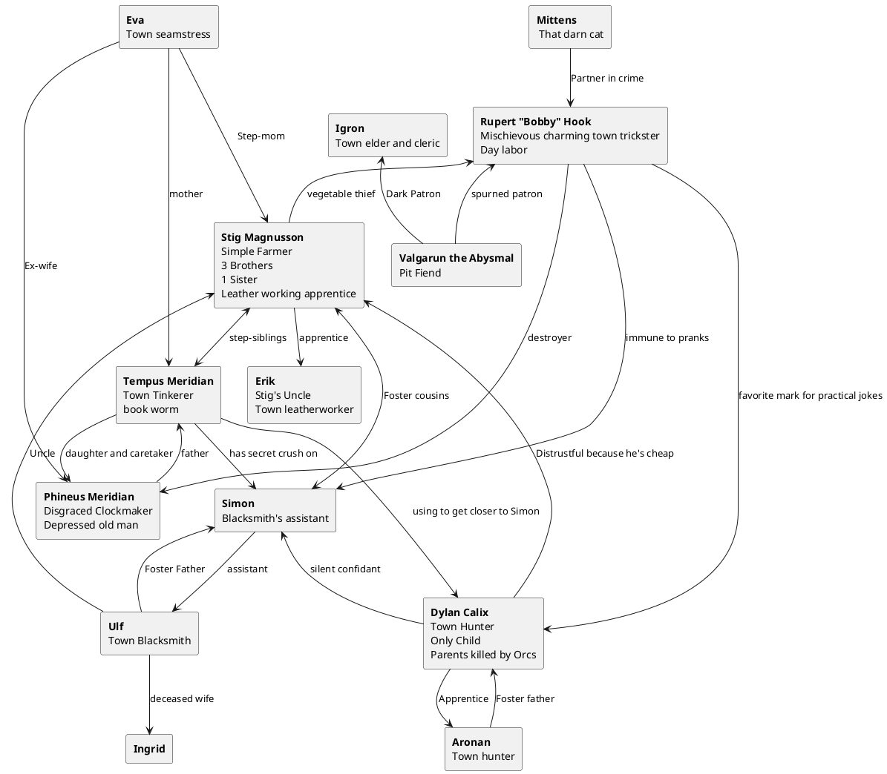

Campaign Notes
==============

Background
----------
A little backstory, your village of Vendido has about 1000 people. It is a small rural village on the edge of the great kingdom of Toran. The village is led by an village elder and cleric, Igron.

Butted against  the open spaces of the farm land is the dark forest surrounding the town. Full of gnolls, orcs, trolls and other savagery.

Alignment
---------

This campaign uses a numerical alignment system

#### Alignment Point Range
| Range  | Start |         |         |
|--------|-------|---------|---------|
|0-30    | 15    | Lawful  | Evil    |
|31-69   | 50    | Neutral | Neutral |
|70-100  | 85    | Chaotic | Good    |

#### Starting Alignment Compass
|  Starting   |         Lawful         |        Neutral          |        Chaotic          |
|-------------|------------------------|-------------------------|-------------------------|
| **Evil**    | Lawful(15) Evil(15)    | Neutral(50) Evil(15)    | Chaotic(85) Evil(15)    |
| **Neutral** | Lawful(15) Neutral(50) | Neutral(50) Neutral(50) | Chaotic(85) Neutral(50) |
| **Good**    | Lawful(15) Good(85)    | Neutral(50) Good(85)    | Chaotic(85) Good(85)    |

Characters
----------

</object>

Places
------

Vendido
: The Party's Home village
: A village of about 1000 people. It is a small rural village on the edge of the great kingdom of Toran. The village is led by an village elder and cleric, Igron.

The Dark Forest
: Butted against  the open spaces of the farm land is the dark forest surrounding Vendido.
: Extending for many leagues in all directions few from the smaller villages ever bother to travel through it.
: Full of gnolls, orcs, trolls and other savagery.

Avernus
: The first level of hell. The main battleground of the Blood War.

Players
-------

- Clem
- Dave
- Jim
- Martin
- Rob

Story So Far
------------

#### 2021-09-23
At the fall harvest festival a rider from the king arrived with grave news. The forces of the Dark Forest are  rising against the kingdom of men. 100 young strong backs from Vendido, including the party, have been conscripted into the King's Army.

Each was equipped with a long spear and leather armor. Igron gave an ominous speech to the group on the importance of their sacrifice for the worlds of men and wished them luck.

The group is preparing to venture out of the town at first light.

#### 2021-09-30
Captain Wallington leads the group out to join the army. On the way the 100 encounter an army of Gnolls and Ogres.

They fought valiantly, but in the end everyone in the army fell. The last thing any of them remember is a great fire sweeping the battle field.

They awoke to find themselves shackled, their clothes and armor in tatters as if from ages past, and the rest of their equipment gone.

They could tell they were not longer alive, and worse they were in hell.

A bearded devil yelling at them "Get up you maggots, WELCOME to the Blood War"

having developed a set of outsider traits the group is being dragged toward who knows what fiendish fate.

#### 2021-10-07

The characters were processed through initial entry. Some signing on for the blood war, Dylan. Others using guile to get to the Glowing Coral, the best, only, vegan gluten-free all you can eat buffet in Avernus. The place is filthy, but probably would just pass health code (with a small bribe).

Valgarun, Igron's dark patron,  came to personally welcome Bobby Hook. He spurned his offer for power.

#### 2021-10-14

Dylan is searching for the Blasphemous Library. The party leaves the Glowing Coral thru the turnstiles, being told once outside "no reentry".

Dylan accepts a duel from a large noble fencer. The fencer makes short work of Dylan rapidly sending him back to the barracks.

Stig, Bobby and Tempus turn in a quest to get a shovel for the servant of The Strangler.

Simon convinces the dwarf running the forge where the shovel was stolen to let him forge a new hammer and a pair of tongs.

Dylan, Bobby and Tempus fetch a deck of cards so that the magician can show them a magic trick. He booby traps Dylans card and douses them in blood.

The party finally meets up outside the library, as they are about to enter portals from the abyss open letting in a sea of demons and Mittens.

#### 2021-10-21
During a short 10-day skirmish in the blood war most of the city of Kaern was destroyed. The party was split early in the fighting and were each forced
to go into hiding.

The party members in the library were unable to find the contract as the stacks were sorted alphabetically by author.

A huge Balor, Baeleretrix, convinced Stig to help him destroy the only library that Dylan knew had a copy of his contract.

Simon and Stig were killed by demons.

The battle caused a lot of soulidus to change hands, as demons and devils killed each other.

Bobby Hook made a new friend a Sheriff Katherine Johnson, who helped reunite the party and told them
about a breach she found through the city walls.

The party in the city left and after a couple days of searching found the rest of the party in the wasteland surrounding the city.

#### 2021-11-04
The party followed Dylan thru the wasteland toward the more rocky area they originally arrived, in order to find a shelter.

On the way, there was howling. They were chased up onto a rocky precipice by a small pack of hell hounds.

After finding they could not get up to the party and were going to be slowly picked off the hell hounds ran off.

As they were climbing down Dylan noticed that the top of this rock outcrop was an entrance to a pocket dimension home to
a gnome wizard named Paul. In experimenting with inter-dimensional travel he got stranded here. He set up this pocket dimension to keep
himself safe. He invited the party to stay a few days, and they agreed to deliver his notes to a library in a higher plane.

#### 2021-11-18
Stig and Simon decided they didn't like the idea of collecting soulidus.

Simon decided to start forging. He needs to go back to town to get advice from the dreugar.

Dylan made a short bow out of the remains of the hell hounds.

Bob read the Tome of understanding getting +2 Wis.

Stig touched the book of vile darkness.

Tempus has the book of vile darkness and a Chronicles of a trip to Mechanus.

The party wants to go back to town.

Paul wants the party to collect the remains or 5 lemures(or similar), summoned by a bearded devil.

#### 2021-12-09
On the way back to the city, the party came upon a gang of demons looking for trouble.

3 quasits and 4 dretchs. 2 quasits escaped.

The party continues on their way to town.

#### 2021-12-16
The party barely killed a Hellcat at the entrance to a cave into the city.
Remaining HP
- Stig: -4
- Simon: -12
- Bob: 2
- Tempus: 9
- Dylan: 19

#### 2022-01-13
The party hid and tried to rest just inside the entrance to the cave, Dylan keeping watch.

Travelling further into the cavern the party encountered a giant swarm of rats, defeating it they made their way into the city.

#### 2022-01-20
Party acquired quest from ice devil lord of city to eliminate a rogue bearded devil, Illanthal.

#### 2022-02-17
The Party has just thrown back the curtain in a transported monastery to reveal a group of devils supporting the bearded devil they are tracking down.

They just finished off the bearded devil, 5 imps and 6 Lemures.
 searching they found a robe of the stars with 2 stars and a giant snake embroidered on it.

#### 2022-03-10
In the back room they find 6 slaves
- female half-orc timid delinquent Dead
- female half-elf passive doctor Gwendolyn Paine w/party
- female elf annoying inn keeper Galanthoril
- female human delicate leather worker Sidney Kane w/ party
- male human helpful peasant
- male half-orc quiet tanner

After travelling 2 of the 3 days back to the gnomes hideout and crossing ravanger tracks the party was ambushed and surrounded by 2 Medium beholders.
Sidney failed her stun save.

#### 2022-03-31
After a harrowing battle the characters managed to defeat the 2 smaller gauth beholders. To do so, Tempus had to tap into the dark knowledge of the tome
of vile darkness.

Sidney sleep thru the battle, affected by the stun and sleep rays.

#### 2022-04-28
As the party made their final way back to the gnomes home, a hell storm started to roll in. The party quickly found a cave to hide in. built an entrance
and plan to rest out the 13 hour storm.

They found a ravanger symbol near the entrance, and built a door to barricade the entrance.

Tempus decided to try to destroy the book of vile darkness after critically succeeding a decipher script check.

After leaving the tome in the hell storm it remained unscathed.

As she turned back into the cave, a Bone devil burst in from the storm demanding "I know the book is here, give it to me"

#### 2022-06-02
After turning the tide against the bone devil he swore vengeance against Tempus and the party before teleporting away.

The Hell storm ended and the party returned to Paul the gnome's magical hideaway.

The party took some time to rest while Simen and Dylan took some time to craft there items.

Paul took the materials and crafted a ring gate that would allow the party to return to his pocket dimension.

#### 2022-06-16

The party traded Illanthal's head for access to the portal to Mechanus.

After passing thru the portal, Tempus was affected by PLanar shock, -1 to all d20 rolls until given a full chance to recover.

The party found themselves deep inside a formian hive surrounded by a dozen formian warrior demanding they comply and join the hive as workers.

They didn't accept the offer and have decided to fight.

#### Interlude
The party brought back a bunch of formians, but the fight spilt over into paul's lab.

The destruction from the fight caused the loss of some needed spell components, particularly mandrake root.

The party returned to the city to acquire some.

The party again avoided a roving band of ravengers

Then entered into the city though the passage under Klar Kuthon's pottery shop.

There they were attacked by Klar's guardian scorpians after being alerted by shrieker mushrooms

The party was split when the half that was scrapping the scorpian corpses was shooed out of the basement while the other half rested in a rope trick.

#### 2022-07-14
The party found a source on mandrake root from a local bartender and brewer, Boran Theus.

He works a a bar called the Astral Star. The wall behind the bar at the astal Star is a giant tear in reality to the swirling other worldly depths of the Astral plane.

Boran said that the mandrake root they need could be gotten for 10000sp. The party does not have that kind of money or barter.

There was a young planes walker, Klar Kuthon, who fell into Avernus while exploring the Astral Plane.
He was willing to give the partly 1200gp for a piece of jacinth.
He helped Bobby Hook learn locate object.

#### 2022-??-??
The party squeezes into a crag in the passage under the city to search for a piece of jacinth.
