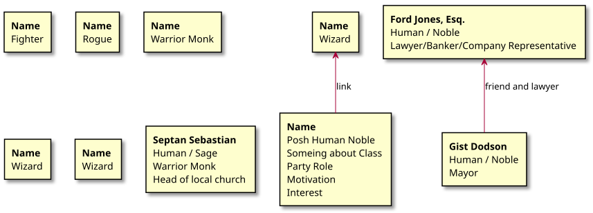
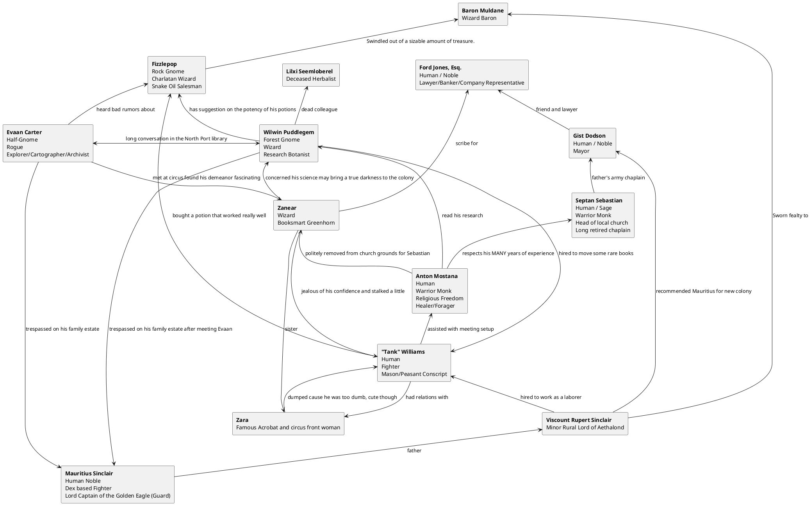

Campaign Notes Dodson Colony Game
=================================

Background
----------

Characters
----------

<!--

-->

Log
---

#### 2026-04-22
##### Wodensday 18th of April 2769
- **Weather** Sleeting Mist

The Party boarded the Ohana and left for the colony under mildly sleeting conditions.

Shortly after leaving Zanear and Wilwin started to develop motion sickness.
Wilwin found a root among his collection that helped keep it under control.

#### 2026-04-29
##### Fryaday 6th of May 2769 - The Mother's Day
- **Weather** Clear, Sunny, Cool

16 days into the voyage, the party discussed being home sick, saw some of the ocean's wonders, and got a treat with there dinners.

Anton lamented the lack of Mother's Day spring berry treats of his youth here at sea. Anita Baker comisserated looking forward to when the colony would be ready to produce fresh baked goods. Hoping that the first wave colonist had successfully grown and milled a supply of flour.

Up on deck Gist Dodson recounted that he looked forward to getting back to the colony, he was forced to leave behind his wife and new born daughter who was too young to travel.

A spectacular show of nature's fury was unveiled as in the distance a great bird was picked from the sky by a multicolor iridescent leviathan.

A dried fruit pastry was provided by the quarter master with dinner rations. Not a noble dessert, but welcomed by the crew and passengers after so long eating dried meat stew, particularly Anton.

As night settled in Wallace Wainwright noticed a strange glow coming from the ship's wake. Wilwin got Zanear to Mage hand him a sample in a vile.

#### 20xx-xx-xx
Everyone then settled in to sleep in the main hold of the ship.
