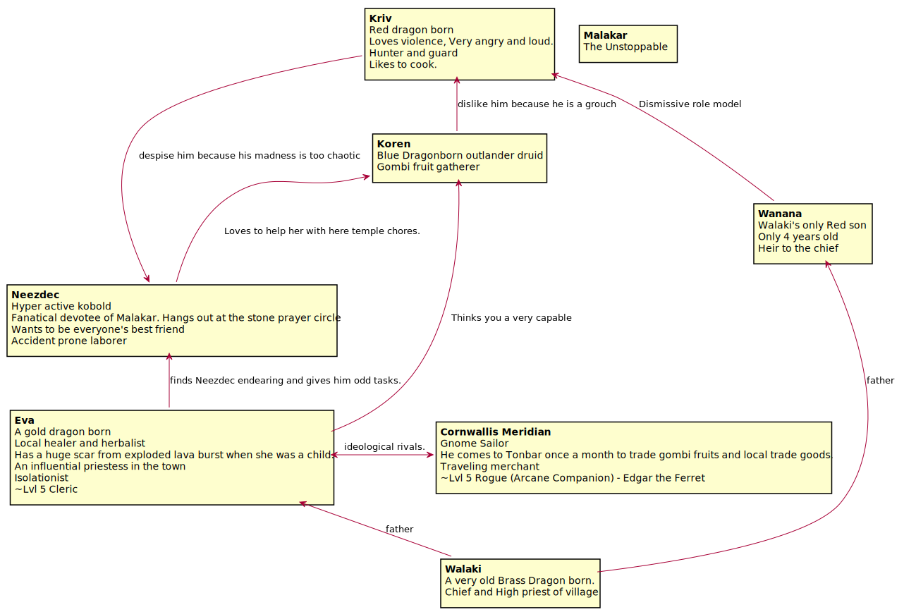
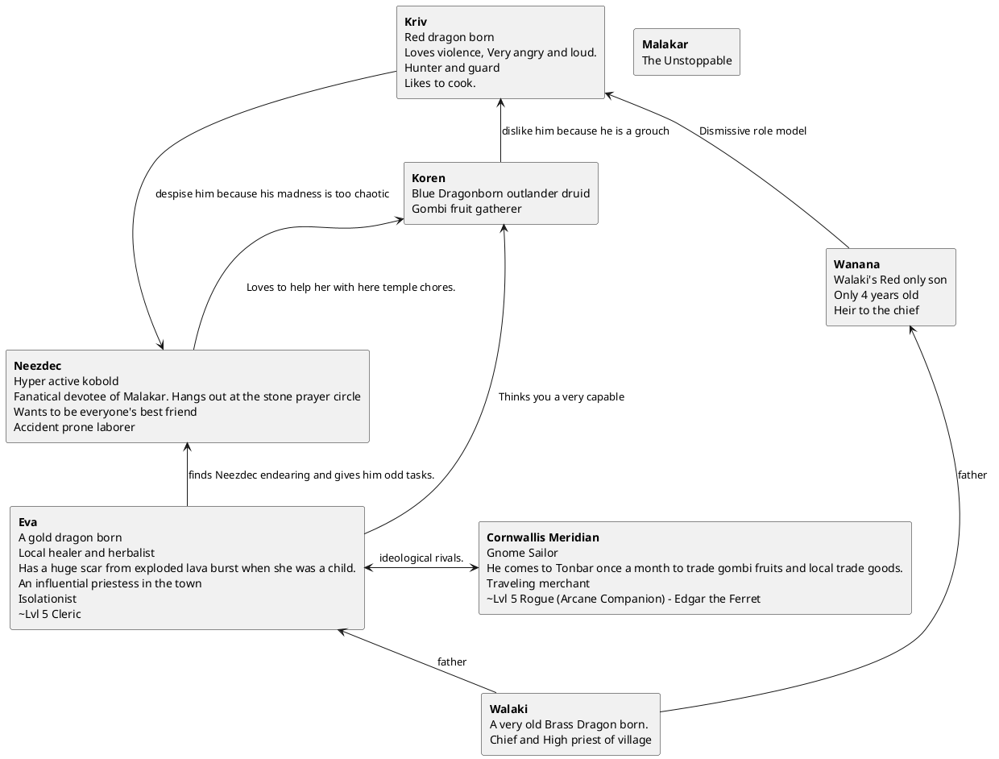

Campaign Notes Saturday 5e Game
===============================

Background
----------
 A small village, Tonbar, of huts near the base of a sleeping volcano, named Malakar, the ancient Dragon God.

 The community large subsists on hunting and gathering the plentiful gombi fruits that grow nearby.

Characters
----------

<!--

-->

Log
---

#### 2022-07-16
An ominous omen at the end of the prince's birthday party put the villages priestess on edge.

under cover of darkness 2 weeks later, a pack of sickly wolves attack the village

Koren and Eva determined something in the forest drove the wolves out of their normal hunting grounds

Eva asked the party to investigate the forest.

#### 2022-10-22

After starting a map of the island, the party decided to follow the river into the forest.

They caused a landslide on the river bank, Kriv and Koren got stuck in the mud.
With some help from Neezdec they were able to get out.

As they cleaned up a small school of pirahnas got curious and tried to take a nibble. nothing a little
lightning breath can't solve.

After continuing north they encountered howling to east. investigating they found
a wolf pack. Using speak with animals they were able to come to a diplomatic solution
involving them as guides deeper into the forest to where the spiders had pushed
the wolves out of their territory.

The party was about to rest in the wolves den.

#### 2023-04-09
While resting in the wolves den the party, they awoke to the sound of howling.
The wolves raised the alarm, the unnatural enemies turn out to be two very old zombies.
after defeating them the party quickly returned to sleep to get up a little late the next
morning, but set out on the journey to the cave.

On the way there the were almost ambushed by a giant spider but prevailed against it.

After that they made haste for the cave. Getting there the wolf guides told Koren that they
smelled spiders and fouler things deep within the earth. Then they wished them luck on their hunt.

#### 20xx-xx-xx
