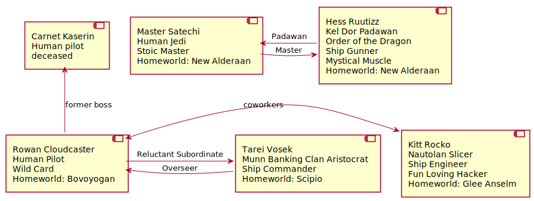
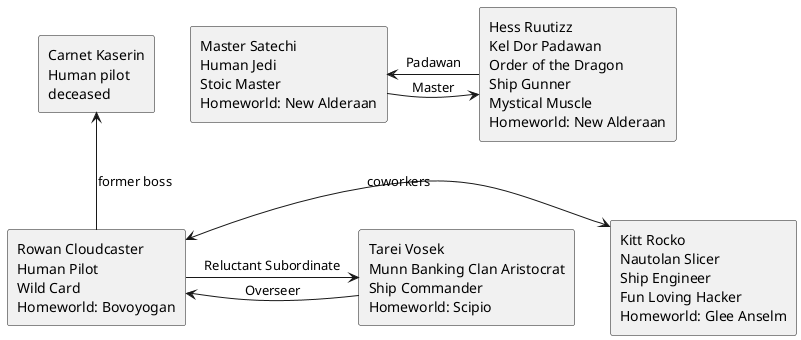

Campaign Notes
==============

Background
----------
This campaign takes place about 50 ABY.
The age of rebel heroes is at an end.
The New Republic is gaining support and political power in the core as much of the galaxy remains fractured.
The 5 sects of Jedi try to be a beacon of good in these trying times.

Characters
----------

<!--

-->

Jedi Sects
----------

Riado School
: A monastic order of Force worshiping martial artist monks, predating the time of Luke Skywalker.
: Though seldom seen the 2000 year old founder Master Riado is still alive and supposed met Luke
shortly after the destruction of the 2nd Death Star.
: Base of operation: The Monastery on the isolate outer rim Planet Riado

Order of the Dragon
: A group of Force wielding warriors focus on connection to the force in all life around them and the direct
elimination of dark-side influence
: Founded by a pair of force sensitive refugees from Alderaan looking to help restore the Sith polluted planet that
would come to be known as new Alderaan
: Base of Operation: The Garrison on New Alderaan

New Republic Guard
: The NRG are tightly tied to the bicameral senate of the New Republic
: The NRG believes it was the arrogance and separation of the Jedi that led to the fall of the Old Republic.
: The NRG act under senate approval, and advise the senate in all matters Force related
: The NRG also allows non-force sensitives to join their ranks in service to the New Republic. These members are expected
to fully participate in all Jedi mental and spiritual rituals and will usually have an at least ceremonial light saber.
: Base of Operation: Coruscant

Hand of Peace
: The most enigmatic sect of Jedi. Hand of Peace Jedi are powerful, yet seldom seen. The lone oldest member of their order
is the only one who attends grand counsel meetings. He always says nothing there only listening
: No other Hand of peace is known. It is said that the others hide among the people of the galaxy or even other Jedi Sects, often posing as wandering Jedi.
However the worst of the citizens of the galaxy fear drawing the attention of the Hands. As it is said they will eliminate them atom by atom until the last.
When you see the symbol of the hand you know your time is short.
: Base of Operation: Unknown

Wandering Jedi
: A diverse group of Jedi who largely pass their training on Master to Padawan one on one.
: Most believe the failings of the Old Republic Jedi came from their reliance on Mass indoctrination and isolation from the common people of the galaxy.
: They believe that Jedi training should be a personal affair between the Master and Padawan. The Master always mindful of the humanity of the padawan. The padawan always mindful of the experience of the Master. Each responsible for the safety Physical and Spiritual of the other. If a Wandering Jedi does fall to the Dark side, their Master or most senior Padawan will usually take it as their duty to bring them back to the light or eliminate them.
: Base of Operation: None, though many would cite the new Jedi temple on Coruscant

Planets & Places
----------------

New Alderaan
: Originally known as Charbon this lush forest planet was corrupted by Sith scientists at Emperor Palaptine's request in order to cultivate beasts that
could be used against his enemies. After the destruction of Alderaan, the refugee's of the planet who happened to be off world at the time decided to choose a new world to colonize as home. After the discovery of the twisted remains of Charbon, they decided it was a prime candidate to show how virtue can overcome the adversity of the dark side.
: The primary settlement has about 500,000 inhabitants, about half of which are descendants of Alderaan.
: The only other permanent settlement on New Alderaan is the Order of the Dragon Garrison. Home to about 1,000 Jedi and Padawans.

The Tyrant's End Cantina
: a popular watering hole on New Alderaan near the space port.
: Run by a retired Rebel pilot who you get a sense has seen it all.

Halecian Sun
: A luxurious casino on the planet Canto Bight

Scipio
: Home world to the Muun. The primary operating location of the banking clan.

Kijimi
: A mountainous cool temperate planet. A common trade hub in the region, a reasonably high population, some resource mining.

Players
-------

- Aaron
- Muhaimin
- Nate
- Ken
- Phil

Story So Far
------------

#### 2021-09-29

Rowan awoke to find himself in the midst of a battle the Quantum Terrapin was already loosing.

The rest of the crew had been sucked into space by a hit that tore open the cockpit. Fortunately being in the engine room he was only briefly knocked unconscious.

The space pirate were preparing to board the ship. Thinking quickly he got one of the ion engines back on line, got into a space suit
and turned the unrepairable fuel system into a explosive that he used against the pirates just before they came aboard destroying there ship.

Claiming the salvage. He hobbled to the closest planet, New Alderaan. Where he immediately when to the local cantina, The Tyrant's End.
There he picked up some new companions an eager Specialist, Kitt Rocko, and a padawan moving in secret, Hess, with his master.

After making some minimal ship repairs, including a B wing gun turret and an astromech to fill in for the missing Nav Computer.
They left for Scipio, the home world of the Muun and center of the Banking clan.

##### or

Open on Aaron. He's minding the engines. Sudden explosion, the ship comes to a stop. Aaron tries to fix things but it doesn't work.
He heads from the reactor core to the bridge.

As Aaron opens the door to the bridge, all the air is sucked out. The entire bridge has been blown open.

Aaron fights his way to the captain's quarters. Finds an antique compression space suit. Pirates are attacking!

The fuel system is leaking badly from the attack. Aaron rigs it to explode when he ejects it towards the pirate ship. The pirate ships sees it, fires and misses.
It blows up their ship and stops the attack.

New Alderaan is the closest planet. Aaron tries to tow the pirate wreckage along with him for salvage.
Strikes a deal with a passing ship to split the salvage and help him bring the ship in.

Sells the ship for scrap.

Dockmaster points him to the Tyrant's End cantina.

###### Focus Shift

Nate is on New Alderaan. Recovering from a job gone bad. He was hacking a system and the people he was working with knocked him out, leaving him to take the fall.
Recently released from prison.

Aaron meets and recruits Nate in the bar. Meet's Ken and spins tales about how the Jedi's are all frauds.

Master Satechi(Iktotchi) enters the bar. He was talking with the Order's council, there is a disturbance in Scipio, home world of the banking clan. We should book passage.

We do book passage. Take a trip to the market. Buy a laser cannon, in excellent shape, off an old B-Wing. Can't afford/find a nav computer.
Decide to buy an astromech, calculate the course before leaving, and then store the data in the mech. S-19. Mech can store 5 jumps.

#### 2021-10-06

Upon arriving at Scipio, the team is greeted by a Muun banking clan bureaucrat, Tarei. He then takes Rowan and Kitt out to diner.
He takes in what he can of Rowan's story and passes it on to his superiors.

Hess and his master look for suspicious activity they find reports of a break-in at a museum where nothing was stolen. They recruit the rest
of the party to help them break in to investigate.

When they get there they find in is a collection of relics from Exagol. The Force sensitives sense a dark presence in the exhibit.

Master Satechi, perhaps over zealously,  grabs the focus of the breaking and their investigation an amulet.
On picking it up the amulet spews forth a giant dark side lightning elemental that immediately incinerates Satechi.
Hess grabs his masters broken light-saber and the amulet as the elemental chases the party out of the museum.

Rowan use some fancy driving to escape the elemental as it slowly dissipated into the dawn clouds.

#### 2021-10-13

Coming to terms with the death of his master, Hess decides that he needs to get back to New Alderaan.

Meanwhile, The Banking Clan thanks Rowan for his service and negotiates the new terms of his loan for ownership of the Quantum Terrapin.
They recommend he bring on a crew of about 4 including the required Bank representative, Tarei, to oversee their finances.

Waiting for the ship the party decides to further investigate the amulet.'

They discover a local Twi'lek fence Chr'lot met two "cultist monks", a male zabrak and a female human, asking about the amulet and how to make contact with a slicer.
The slicer she made the connection for them with later turned up dead of natural causes.
Chr'lot shared the dock number, 11-38, where the slicer was supposed to meet the two mysterious strangers.

#### 2021-10-20
The party planned a simple heist to  break into the dock. While Hess distracted the front desk, the rest of the party moved to the docking bay,
unlocked the door and snuck in.

The docking bay formerly docked the Rustic Skull, a small cargo ship currently transporting passengers, The last jump on astrogation computer was to Kijimi.
Rowan found a "very" important rigid flip-flop. Kitt found a more recent 2 credit poker chip for the Halecian Sun, a casino on Canto Bight.
Pilot Randerick Jonsszs, passengers Mary and Jon Smith obviously fake names.

#### 2021-11-03
As we're leaving the docks, a shadowy figure approaches us. He grabs Torei and pulls a knife. "You'd be wise to forget anything you saw in that dock. This is a friendly warning." Torei bluffs and says "We didn't find anything." Rowan holds up the flip flop and says "I've found your secrets!" in such an intimidating manner that the guy withdraws.

Attacked by four of his friends. Take down three, intimidate the last to surrender. He says "Your deaths are inevitable, you will not stop the rise." Then bites down on a drug tooth and dies. Hess tries to track down the initial guy. Can't find a trail.

Kit hacks a computer terminal and searches the cameras. Finds info that he was at a nearby pizza place. Hess tracks him down and we start following him. He left a bloody hand print on the door to an auditorium where there's a presentation on The Negative Effects of VibroBlades in Our Society.

We enter. Kit climbs up to the rafters and dims the lights. Hess searches and finds the guy. Torei sneaks up, puts a gun in his back and gets him to surrender. He says "I'll tell you everything, just promise not to kill me."

	Who do you work for? I was hired by a human male and zabrak female to keep an eye on that spaceport and scare off anyone who came poking around.

	What else can you tell us about them? They gave me a comm code to tell them if anyone came poking around.

	We tell him to give us the code. Planet code was issued on Scipio.

	Get the code.

#### 2021-11-10
Tarei disguised himself as the shadowy henchmen, Dal Magow. Called the number and stalled for time while Kitt and Rowan hacked the connection to find out about them.
They were still in the Rustic Skull, and currently approaching Kijimi. Kitt modified the Skulls beacon so that the team could track them if in the same system.

Afterward the party decided to use their contacts among the banking clan to acquire work while waiting for the Terrapin to finish repairs. They took a bounty:

- Kleeg Corrnalis
- Quarren alleged kidnapper
- bounty 20000 credits, alive

#### 2021-12-15

Kleeg was accused of kidnapping Mer'l'n Turnar, who is currently missing.

The party was able to track Kleeg to his apartment where they caught him just as he was packing to skip town.
He put a bomb trap on the door, which went off as the party came in. Kleeg then jumped out the window blasting at the party, but he was caught by Hess and Rowan.
He was turned in and the party got their bounty.

#### 2022-01-12
The party set out for Kijimi. They received a distress signal from an old imperial shuttle (The Winged Dearth) carrying Captain Krom (human) and 3 other seemingly normal space pilgrims (Annn - human chemist, Jeess - Twi'lek, Mi - Rhodian). They were experiencing problems with their repulsor lifts after taking off from the planet below.

The party sold them a replacement engine(worth $10k) for $11k upfront and $8k when they get to the new system.

#### 2022-01-19
The crew accompanies the Winged Dearth to its destination of Kijimi.

The Rustic Skull is headed to Dantooine.

#### 2022-01-26
After meeting up with the crew from the rustic skull, the party uncovered that they had to go back to Kijimi.

#### 2022-02-09
In order to get under way quicker the crew helped the Kijimi Miner unload his goods from the ship in 4 hours.

They quickly ran out to get back to Kijimi

They were caught in a hyperspace net. by a pair of space pirates with fighters.

After defeating them the Terrapin's Hard drive remains damaged. The crew found a small freighter that was generating the hyper space net and encountered the droid on board.

#### 2022-02-23
After boarding the ship the crew found that the ship was empty except for the droid and 2 escaped pit fighting beasts the were destroying the ship.

The party defeated them and salvaged a bunch of the ship while S19 repairs the hyperdrive.

Then they head for Kijimi.

#### 2022-03-09
After doing some shopping on Kijimi.

The party met the Captain Krom and the other Pilgrims for dinner at the Bantha Bone restaurant, serving their famous Kajimi Mine shaft steaks. Annn convince[tricked] Rowan to try one as it was plasma burned. He immediately found it to be the most delicious thing he ever ate.

The Party is now in the market for some grilling gear

After discussion the party decided the most suspicious place to look for there quarry was a suspicious old mine shaft on the east side of town.
Mi offer to act as a guide while the other pilgrims stayed behind.

#### 2022-04-06

Before leaving Kitt looks into the old mine discovering some news headlines relating to the old Bliss Mine.

The general belief that it is haunted or monsters or wild animals live there.

Inside that party was attacked by a pair of large bear like creatures. Kitt was able to use a trigger on a transmitter he found to set the running as it connected to shock collars.

They passed a secret ladder inside the elevator shaft and found the original scheme of a old mine collapse that caused the mine to close.

#### 2022-04-25
The party encountered some dark side entities trapped in the rocks.

They found that some of the original miners were killed by these entities.

Continuing to explore, they found a camera which summoned 5 Storm troopers.

They failed to hide from them.

Rowan is on his knees disarmed surrounded being taken into custody.

Hess decided to charge them.

Kitt is hiding in a different corridor.

#### 2022-05-02
After defeating the 5 storm troopers the party decided to head back to town.

After resting up they found the mine had been burnt out during the night.

#### 2022-05-09
Hess set out to find an alternate entrance while Kitt went back to town to trace the call to emergency services.

While Kitt traced the call back to a specific pay phone in the city, Hess and Rowan searched for a found a promising cave entrance
brimming with dark side energies.

The party went into the cave found and defeated another dark side spirit, and then found a massive chamber containing an ebon tower.

A group of scientists with a mildly familiar insignia study the temple.

The party dropped down the back of the temple and...

#### 2022-06-20

The party overheard the mention of Harrah Dane, human female cultist, going to Canto Bight.

The party fought thru some storm troopers and disabled a bunch of scientists and technicians.

During the fight Kal Klutos, male Zabrak cultist, attempted to escape on a speeder bike losing Kitt in a bend in the cave.
Rowan then lined up shot disabling his stabilizer resulting in him losing control and bowing up the speeder.
All that remained of Kal and his Speeder was the crystal from the amulet.

The crystal fit into a keyhole on a box in the temple. The box was full of ancient Sith writings amounting to an alchemical manual
Life/Death:extracting the cosmic force to imbue the living force.

#### 2022-06-27

Hess takes the red key gem.

Kitt has code cylinder with recording of Sith manual.

The crew picked up a large mysterious box they were instructed not to open from the Banking clan to ship to New Alderaan.

They are heading back to new Alderaan to check in with the council there.

#### 2022-07-25
While delivering the former leader of the Red Sons Gang to the banking clan, The party was attacked by gang members they were able to scare them away with little trouble.

The party returned to the Garrison.
There they were greeted with open arms and prepare to go before the counsel to tell their story.

#### 2022-08-08
The Trials:
Skill - Light Saber - The Storm Troopers on Kijimi
Courage - Resist fear/ Brave battle - Dark side Yeti
Flesh - Loss of material things - Death of Master
Spirit - Self-Reflection - Focus the force to overcome some otherwise unbeatable darkside spirits
Insight - Seen through deception - Tracking the on the run Sith Cultist through the galaxy.

Rowan spent 1.5 months upgrading the ship.

Kitt: A Tabaxi named Ivanna Ravi, she put together Kitt's bad mission that resulted in his incarceration on New Alderaan.

Partners Orwen and Grethal.

#### 2022-08-27
po-ne-biology
Ivanna went off with her crew to ____.

After completing the Trials, Hess's first assignment was to investigate his former Master's death.

The Order of the Dragon commissioned Rowan and his crew to aid the new Jedi.

The party left for Corasant to get more clues into the Sith carvings they found on Kajimi.

Due to a Hyperdrive malfunction they had to set down on Jakku, the scrapyard of the old empire.

While there they had a run in with a uppity Mon Calamari space yacht club, and restocked on parts.

#### 2022-09-12

- Force Dream
    - Is there anything we can do to save or rescue Master Satechi?
    - Should we bypass Coresant and head directly to Cantobyte?
    - Is Hara Dane on or en route to Cantobyte?
    - Is Hara Dane a Sith?
    - Do the cultists we're chasing serve a currently living Sith?
    - Are the cultists trying to raise Sith Lord Palpatine?
    - Is the Sith Rule of Two still being followed?

Encounter on the streets

Repair the hyperdrive

